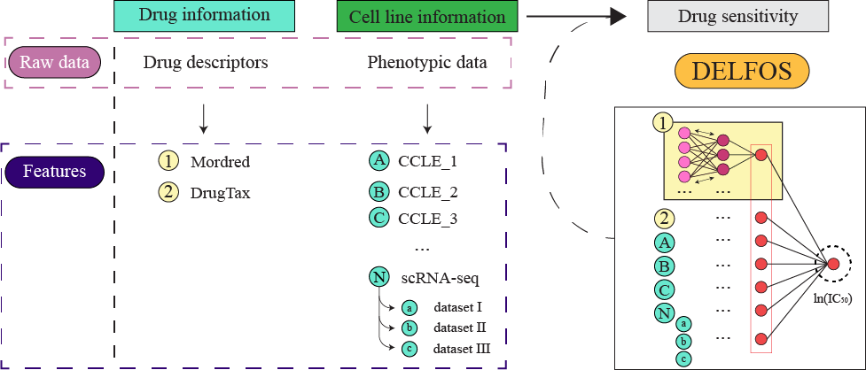

# **DELFOS**
<p>

**Motivation**: Cancer is currently one of the most notorious diseases, with over one million deaths in the European Union alone in 2022. As each tumor can be composed of diverse cell types with distinct genotypes, cancer cells can acquire resistance to different compounds. Moreover, anticancer drugs can display harsh side effects, compromising patient well-being. Therefore, novel strategies to identify the optimal set of compounds to treat each tumor have become an important research topic in recent decades.

**Results**: To address this challenge, we developed a novel drug response prediction algorithm called **Drug Efficacy Leveraging Forked and Specialized networks (DELFOS)**. Our model learns from multi-omics data from over 65 cancer cell lines, as well as structural data from over 200 compounds for the prediction of drug sensitivity. We also evaluated the benefit of incorporating single-cell expression data on the prediction of drug responses. DELFOS was validated using datasets with unseen cell lines or drugs and compared with other state-of-the-art algorithms, achieving high prediction performance on several correlation and error metrics. All in all, DELFOS could effectively leverage multi-omics data for the prediction of drug responses in thousands of drug-cell line pairs.

<p align="center">
</br>

</p>
</br>

## **Environment preparation**
### **Prerequisites**

DELFOS was developed and tested with:
```
Python 3.9.13 | packaged by conda-forge | (main, May 27 2022, 16:58:50) [GCC 10.3.0] on linux ::
conda v4.6.11
```
We recommend creating an isolated Conda environment to run our pipeline, which can be done with the following code:
```
1. conda create --name delfos python=3.9
2. conda activate delfos
```

**Note**: The environment name, defined after the "--name" argument in the first step, can be whatever the user desires.

</br>

In addition to python and conda, the list of requirements can be found in the requirements.txt file in the main directory. These include:


- numpy 1.23.5
- pandas 1.4.2
- tables 3.6.1
- tensorflow 2.11
- keras 2.11.0
- keras-tuner 1.1.3
- mordred 1.2.0
- drugtax 1.0.14
- rdkit 2022.9.4
- scipy 1.9.3
- scikit-learn 1.2.0
- pubchempy 1.0.4
- xgboost 1.7.2
</br>

Some requirements are still not supported by conda-forge, and can be installed using **pip**. To install all requirements and dependencies, run:

```
pip install -r requirements.txt
```
</br>

### **Data download**

Zip files containing original data used in the development of DELFOS are also available here:

- [original_data.zip](link_github) includes the original CCLE files used in our study. These can also be directly downloaded from the [DepMap website](https://depmap.org/portal/download/all/).

- [sc_data.zip](link_github) includes the original scRNA-seq data from different studies:

|       Author       |                                 Identifier                                 | Cancer type | Platform |
| :----------------: | :------------------------------------------------------------------------: | :---------: | :------: |
| Sriramkumar et al. |                                 GSE207993                                  |   Ovarian   | Chromium |
|  McFarland et al.  | [figshare.com/s/139f64b495dea9d88c70](figshare.com/s/139f64b495dea9d88c70) |   Several   | MIX-Seq  |
|   Schnepp et al.   |                                 GSE140440                                  |  Prostate   |    C1    |
|  Kagohara et al.   |                                 GSE137524                                  |    HNSCC    | Chromium |
|  Ben-David et al.  |                                 GSE114462                                  |   Breast    | Chromium |

</br>

### **Directory**

To replicate our pipeline, a the directory should be prepared as follows:

```
DELFOS
│   README.md
│   0_prepare_data.py  
│   0_sc_integration.R
│   1_prepare_sc_data.py
|   ...
└───data
│   │   h5
│   │   original
│   |   │   ccle_sample_info.csv
│   |   │   GDSC2_24Jul22.csv
│   |   │   single_cell_lines.csv
│   |   └───CCLE
│   |   │   |   CCLE_chromatin.csv
│   |   │   |   CCLE_copynumber.csv
│   |   │   |   CCLE_expression.csv
│   |   │   |   CCLE_methylation.csv
│   |   │   |   CCLE_mirna.csv
│   |   splits
│   |   │   leave_out
│   │   processed
│   |   │   bulk
│   |   │   drug
│   |   └───single-cell
│   |   │   |   individual_tt
│   |   │   |   individual_valid
│   │   single-cell
│   |   │   individual
│   |   │   prep
│   |   └───sc_integration
│   |   |   |   BenDavid
│   |   |   |   Kagohara
│   |   |   |   ...
```

### **Note**: The *data/original* and *data/single-cell/sc_integration* directories can be filled with the required files by unpacking the **original_data.zip** and **sc_data.zip** files within their target directories.
### Also, please remember to adjust the DEFAULT_LOCATION variable in *delfos_resources.py* to your directory/path.

</br>

## **Scripts and files**

After performing the changes previously pointed and properly installing and setting up the environment, these scripts should simply run without requiring changes.
 -	`delfos_resources.py` - This includes several variables and functions that will be called throughout the pipeline.
  -	`0_prepare_data.py` - Takes files in the *data/original* directory as input and will yield several files, namely: i) .csv of unique cell lines, ii) .csv of unique drugs, iii) .csv containing drug SMILES retrieved from PubChem, iv) .h5 CCLE datasets filtered to containg the same cell lines as the other datasets, and v) an .h5 file containing the drug-cell line pairs and their respective ln(IC50) values.
 -	`0_sc_integration.R` - Takes the files in the *data/single-cell/sc_integration* directory as input and will follow the [Seurat protocol for scRNA-seq data integration](https://satijalab.org/seurat/articles/integration_introduction.html). Will output a .csv containing the integrated scRNA-seq datasets. 
 -	`1_prepare_sc_data.py` - Formats the integrated scRNA-seq dataset and yields several .csv files, each containing the single cells of a given cell line.
 -	`2_drug_feat_extract.py` - Extracts the drug descriptors from the drug SMILES .csv using Mordred and DrugTax, saving the descriptors as two .h5 files.
 -	`3_splits.py` - Generates the train, test, leave-cell-out, and leave-drug-out splits. The output is four .csv files, one for each split, containing the drug-cell line pairs and their ln(IC50) value.
 -	`4_preprocessing.py` - Will match the previously generated splits with the complete datasets, and process them for input into the model. Features with zero-variance are removed, datasets are normalized, and any missing values are replaced with zeros. This script can take a few minutes to run.
 -	`5_sc_preprocessing.py` - From the files generated in `0_sc_integration.R`, will retrieve a given number of single cells from each cell line, ensuring the same number of instances per dataset. If any cell line had less single cells available than the defined threshold, values are imputed from the median value for the feature for the given cell line. Will output several .csv files, one for each cell line, containing the specified number of single cells.
 -	`6_delfos.py`- DELFOS deep neural network based on keras/tensorflow. All datasets a first loaded and, if scRNA-seq data is used for input, will generate **N** datasets, each containing one single cell of each cell line. **N** is the number of single cells of each cell line that was selected in `5_sc_preprocessing.py`.
  -	`6_delfos_hyperparam.py`- Hyperparameter optimization of DELFOS using KerasTuner with the Hyperband algorithm.
 -	`XGBOOST.py` - Run XGBoost using our datasets, except for scRNA-seq data.
  -	`other_models.py` - Run another neural network with architecture similar to Precily's using our datasets, except for scRNA-seq data.
 -	`requirements.txt` - Text file containing the module requirements for the pipeline.
 - `original_data.zip` - .zip file containing the original CCLE datasets used in the DELFOS pipeline.
 -	`sc_data.zip` - .zip file containing the original scRNA-seq datasets used in the DELFOS pipeline.
</br>
</br>

# **Please cite:**

Luiz Felipe Piochi, António J. Preto, and Irina S. Moreira

[*Piochi L.F., Preto, A.J., Moreira, I.S. - DELFOS: multi-omics-based prediction of cancer drug sensitivity with scRNA-seq data*] PENDING CITATION
